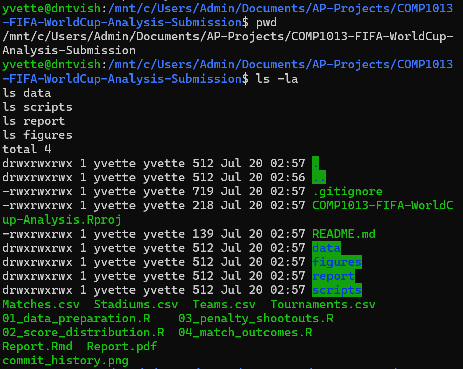
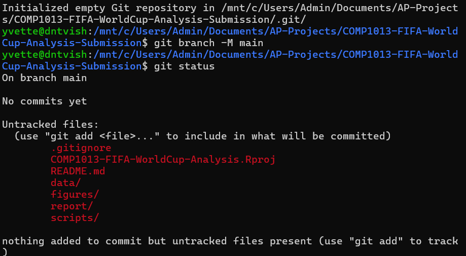
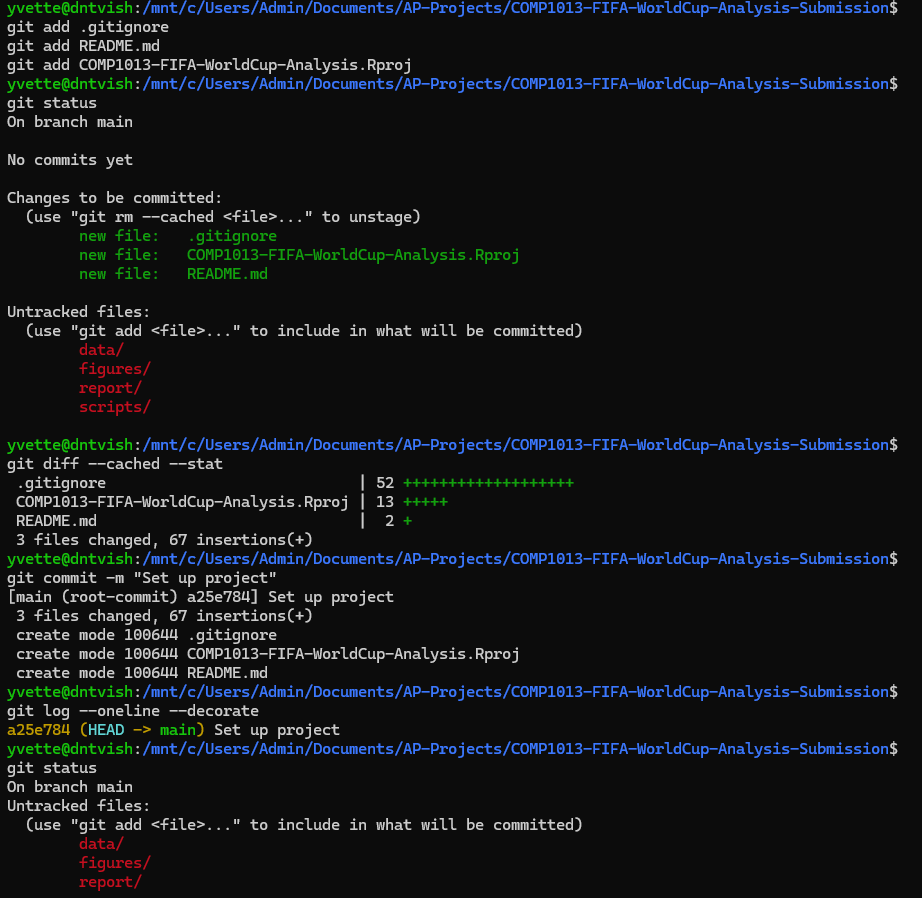
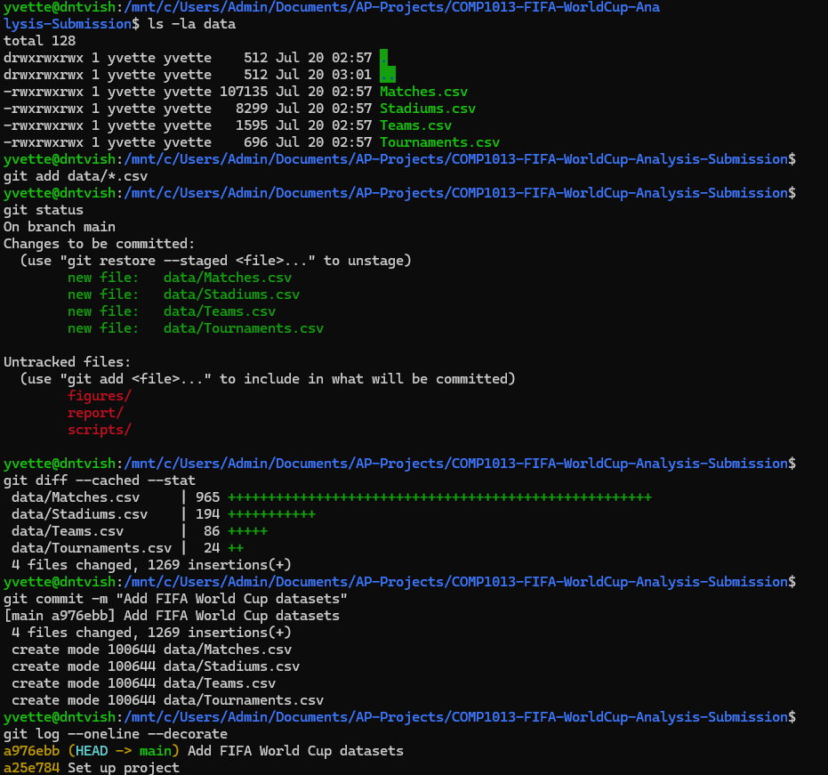
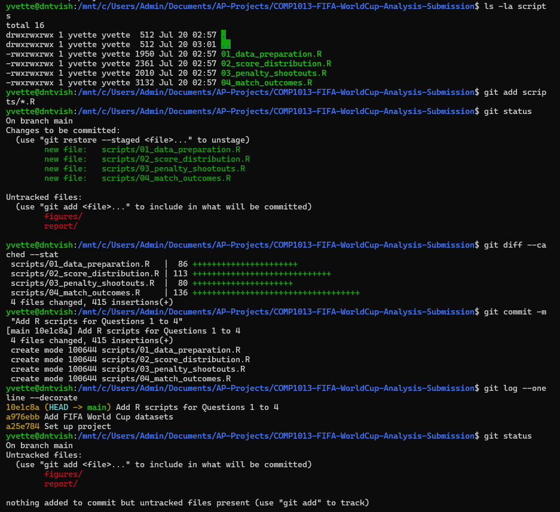
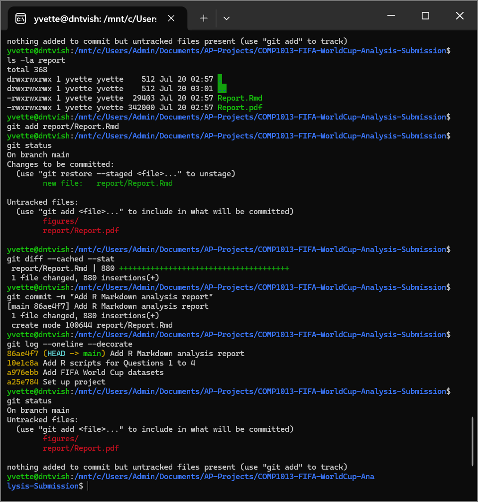
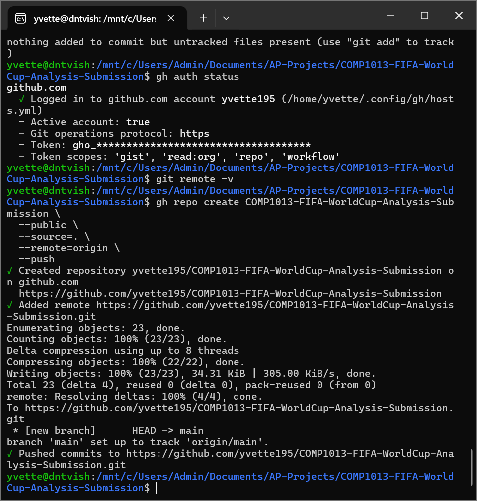
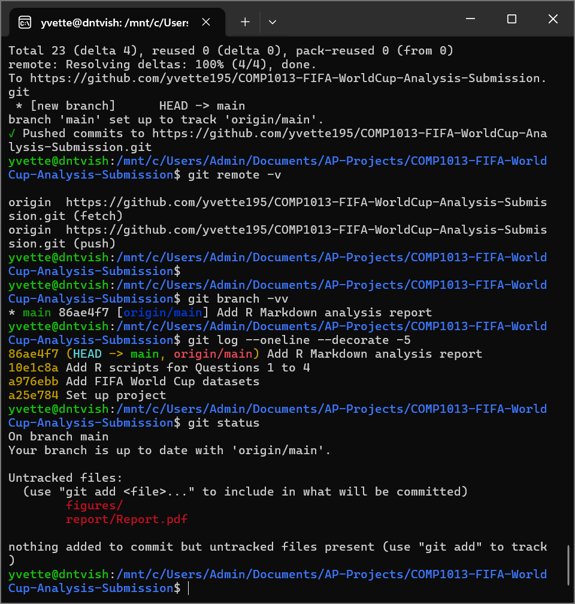
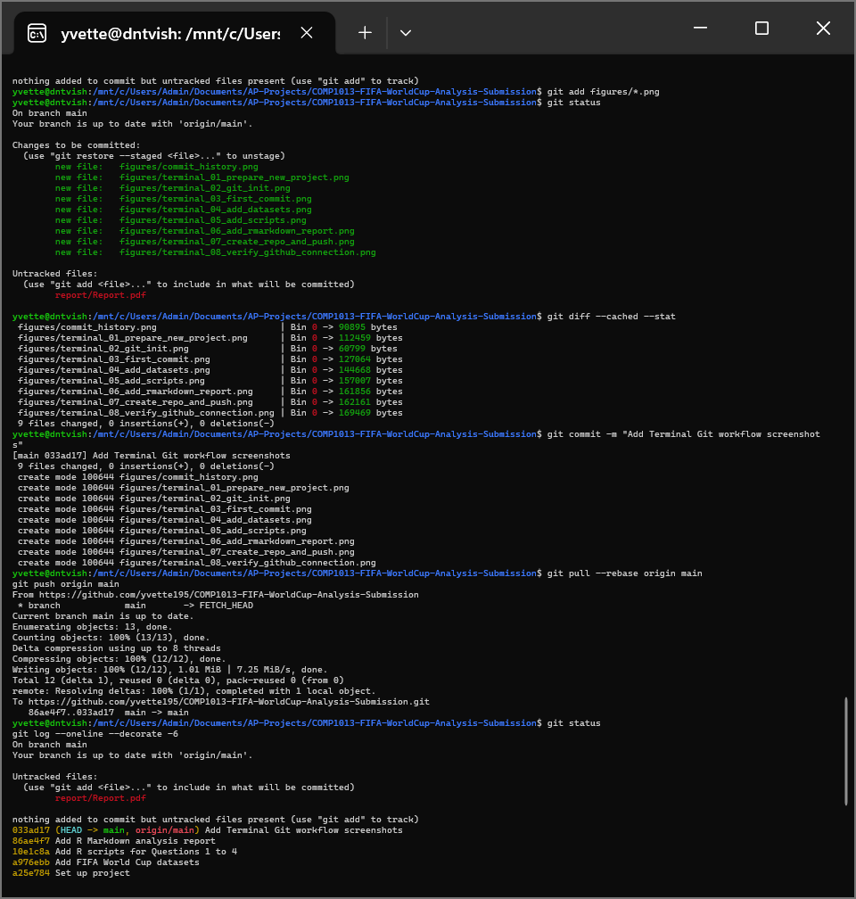
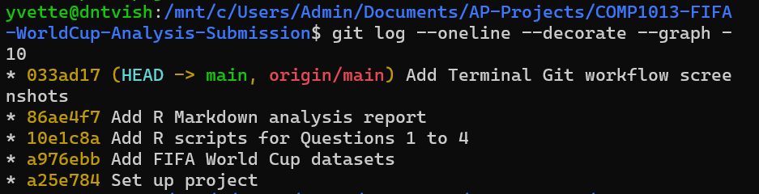

```{r setup, include=FALSE}
knitr::opts_chunk$set(
  echo = TRUE,
  message = FALSE,
  warning = FALSE
)

library(tidyverse)

# Colour palette used for all charts.
darkest_colour <- "#041420"
dark_colour <- "#042631"
middle_colour <- "#4B7273"
light_colour <- "#86B9B1"
lightest_colour <- "#CFD6D6"

```

# Student Information

**Student Name:** Nguyen Dao Truong Vy

**Student Number:** 22202382

**Subject Code:** COMP1013

**Subject Name:** Analytics Programming

**GitHub Repository:**  
https://github.com/yvette195/COMP1013-FIFA-WorldCup-Analysis-Submission

# Declaration

By including this statement, we the authors of this work, verify that:

- We hold a copy of this assignment that we can produce if the original is lost or damaged.

- We hereby certify that no part of this assignment/product has been copied from any other student work or from any other source except where due acknowledgement is made in the assignment.

- No part of this assignment/product has been written/produced for us by another person except where such collaboration has been authorised by the subject lecturer/tutor concerned.

- We are aware that this work may be reproduced and submitted to plagiarism detection software programs for the purpose of detecting possible plagiarism, which may retain a copy on its database for future plagiarism checking.

- We hereby certify that we have read and understand what the School of Computing, Engineering and Mathematics defines as minor and substantial breaches of misconduct as outlined in the learning guide for this unit.

\newpage

# Question 1: Data Inspection, Cleaning and Home Penalty Distribution

## Rationale

I joined the four datasets because the information for this analysis was not stored in only one file. The `Matches` dataset contains the match results and scores, while the other datasets provide the team, stadium and tournament information. Joining them made it easier for me to use all the information in one data frame.

I changed `"?"` to `NA` because `"?"` is only a text value, but `NA` is recognised by R as a missing value. I changed `Result`, `Stage`, `Country` and `ExtraTime` to factors because these variables contain categories. I changed `HomePenalty` and `AwayPenalty` to numeric because they show the number of penalty goals.

I used a bar chart for `HomePenalty` because penalty scores are separate whole numbers. The chart makes it easy to see which penalty score appeared more often and which score appeared less often.

## Load and Join the Data

```{r, question-1-load}
# Read the data CSV files.
matches <- read_csv("../data/Matches.csv")
stadiums <- read.csv("../data/Stadiums.csv")
teams <- read.csv("../data/Teams.csv")
tournaments <- read.csv("../data/Tournaments.csv")

# Change every "?" value to NA.
matches[matches == "?"] <- NA
stadiums[stadiums == "?"] <- NA
teams[teams == "?"] <- NA
tournaments[tournaments == "?"] <- NA
```

```{r, question-1-join}
# Join team information for the home team and away team.
df <- matches %>%
  left_join(
    teams %>%
      rename(
        HomeTeamID = TeamID,
        HomeTeamName = TeamName,
        HomeTeamCode = TeamCode
      ),
    by = "HomeTeamID"
  ) %>%
  left_join(
    teams %>%
      rename(
        AwayTeamID = TeamID,
        AwayTeamName = TeamName,
        AwayTeamCode = TeamCode
      ),
    by = "AwayTeamID"
  ) %>%
  left_join(stadiums, by = "StadiumID") %>%
  left_join(tournaments, by = "TournamentID")
```

## Inspect and Clean the Data

```{r, question-1-inspect}
# Display the first six rows.
head(df)

# Check the number of rows and columns.
dim(df)

# Check the variable types.
str(df)

# Display a summary of the main variables.
summary(
  df[c(
    "Result",
    "Stage",
    "Country",
    "ExtraTime",
    "PenaltyShootout",
    "HomePenalty",
    "AwayPenalty"
  )]
)
```

```{r question-1-clean}
# Convert categorical variables to factors.
df$Result <- as.factor(df$Result)
df$Stage <- as.factor(df$Stage)
df$Country <- as.factor(df$Country)
df$ExtraTime <- as.factor(df$ExtraTime)

# Convert penalty variables to numeric.
df$HomePenalty <- as.numeric(df$HomePenalty)
df$AwayPenalty <- as.numeric(df$AwayPenalty)

# Replace missing penalty values with zero.
df$HomePenalty[is.na(df$HomePenalty)] <- 0
df$AwayPenalty[is.na(df$AwayPenalty)] <- 0
```

## Code Testing

```{r question-1-testing}
# The number of rows should be unchanged after joining.
nrow(matches)
nrow(df)

# Check the classes after conversion.
class(df$Result)
class(df$Stage)
class(df$Country)
class(df$ExtraTime)
class(df$HomePenalty)
class(df$AwayPenalty)

# Check that no missing penalty values remain.
sum(is.na(df$HomePenalty))
sum(is.na(df$AwayPenalty))
```

The number of rows in `matches` and `df` should be the same. This is important because joining the other datasets should add more columns, but it should not remove or add match records.

The four category variables should return `"factor"`. The penalty variables should return `"numeric"`. The two missing-value checks should return zero. These checks help me confirm that the data was changed into the correct format before doing the analysis.

## Results and Interpretation

```{r question-1-results}
# Keep only matches involving a penalty shootout.
penalty_matches <- df %>%
  filter(PenaltyShootout == 1)

# Create a frequency table for HomePenalty.
penalty_table <- table(penalty_matches$HomePenalty)
penalty_table

# Find the most common HomePenalty value.
most_common_penalty <- names(penalty_table)[which.max(penalty_table)]
most_common_count <- max(penalty_table)
```

```{r question-1-plot, fig.width=8, fig.height=5}
ggplot(penalty_matches, aes(x = factor(HomePenalty))) +
  geom_bar(
    fill = darkest_colour,
    colour = "white"
  ) +
  labs(
    title = "Distribution of Home-Team Penalty Goals",
    x = "Home-team penalty goals",
    y = "Number of matches"
  ) +
  theme_minimal()
```

There were `r nrow(penalty_matches)` matches that included a penalty shootout. The most common value of `HomePenalty` was `r most_common_penalty`. This value appeared in `r most_common_count` matches.

From the chart, some penalty scores appeared more often than the other scores. The taller bars mean that the score happened in more matches. The shorter bars mean that the score was less common. The distribution was not equal because the bars did not have the same height.

\newpage

# Question 2: Distribution of Home Team Scores

## Rationale

I used histograms because `HomeTeamScore` is a numerical variable. Football scores are whole numbers, so I used a bin width of one. This means that each bar represents one score, such as 0, 1, 2 or 3 goals.

I compared the home-team scores by `Stage`, `TournamentName` and `AwayScoreGroup`. I separated these comparisons because putting all the information in one chart would make the chart too crowded and difficult to read.

I also used `aggregate()` to calculate the mean and median for each group. The histograms show the shape of the score distribution, while the mean and median give simple numbers that can be compared between groups.

## Distribution by Competition Stage

```{r question-2-stage-summary}
# Calculate the mean and median HomeTeamScore for each stage.
stage_mean <- aggregate(
  HomeTeamScore ~ Stage,
  mean,
  data = df
)

stage_median <- aggregate(
  HomeTeamScore ~ Stage,
  median,
  data = df
)

stage_mean
stage_median
```

```{r question-2-stage-plot, fig.width=9, fig.height=7}
ggplot(df, aes(x = HomeTeamScore)) +
  geom_histogram(
    binwidth = 1,
    fill = darkest_colour,
    colour = "white"
  ) +
  facet_wrap(~ Stage) +
  labs(
    title = "Home-Team Scores by Competition Stage",
    x = "Home-team goals",
    y = "Number of matches"
  ) +
  theme_minimal()
```

## Distribution by Tournament Name

```{r question-2-tournament-summary}
# Calculate the mean and median HomeTeamScore for each tournament.
tournament_mean <- aggregate(
  HomeTeamScore ~ TournamentName,
  mean,
  data = df
)

tournament_median <- aggregate(
  HomeTeamScore ~ TournamentName,
  median,
  data = df
)

tournament_mean
tournament_median
```

```{r question-2-tournament-plot, fig.width=10, fig.height=12}
ggplot(df, aes(x = HomeTeamScore)) +
  geom_histogram(
    binwidth = 1,
    fill = darkest_colour,
    colour = "white"
  ) +
  facet_wrap(~ TournamentName) +
  labs(
    title = "Home-Team Scores by Tournament",
    x = "Home-team goals",
    y = "Number of matches"
  ) +
  theme_minimal()
```

## Distribution by Away-Team Score Group

```{r question-2-away-groups}
# Create an empty variable for the away-team score groups.
df$AwayScoreGroup <- NA

# Assign each match to one of the three required groups.
df$AwayScoreGroup[df$AwayTeamScore <= 1] <- "0-1 goals"

df$AwayScoreGroup[
  df$AwayTeamScore >= 2 &
    df$AwayTeamScore <= 3
] <- "2-3 goals"

df$AwayScoreGroup[df$AwayTeamScore >= 4] <- "4 or more goals"

# Convert the new variable to a factor.
df$AwayScoreGroup <- as.factor(df$AwayScoreGroup)

# Check the number of matches in each group.
table(df$AwayScoreGroup)

# Count the number of matches in each group.
away_group_counts <- table(df$AwayScoreGroup)

# Put the groups in order from the smallest count to the largest count.
away_group_order <- names(sort(away_group_counts))

# Give a light colour to the smallest group and a dark colour to the largest group.
away_group_colours <- setNames(
  c(
    lightest_colour,
    middle_colour,
    darkest_colour
  ),
  away_group_order
)

# Calculate the mean and median HomeTeamScore for each group.
away_group_mean <- aggregate(
  HomeTeamScore ~ AwayScoreGroup,
  mean,
  data = df
)

away_group_median <- aggregate(
  HomeTeamScore ~ AwayScoreGroup,
  median,
  data = df
)

away_group_mean
away_group_median
```

```{r question-2-away-plot, fig.width=9, fig.height=5}
ggplot(
  df,
  aes(
    x = HomeTeamScore,
    fill = AwayScoreGroup
  )
) +
  geom_histogram(
    binwidth = 1,
    colour = "white"
  ) +
  facet_wrap(~ AwayScoreGroup) +
  scale_fill_manual(
    values = away_group_colours
  ) +
  guides(fill = "none") +
  labs(
    title = "Home-Team Scores by Away-Team Score Group",
    x = "Home-team goals",
    y = "Number of matches"
  ) +
  theme_minimal()
```

## Code Testing

```{r question-2-testing}
# Check the score variable types.
class(df$HomeTeamScore)
class(df$AwayTeamScore)

# Check for missing score values.
sum(is.na(df$HomeTeamScore))
sum(is.na(df$AwayTeamScore))

# Check the new group variable.
class(df$AwayScoreGroup)
table(df$AwayScoreGroup)
sum(is.na(df$AwayScoreGroup))

# Check that all matches are included in the three groups.
sum(table(df$AwayScoreGroup))
nrow(df)
```

`HomeTeamScore` and `AwayTeamScore` should be numeric variables. R may show `"integer"` because football scores are whole numbers, and this is still suitable for this analysis.

The missing-value results should be zero. `AwayScoreGroup` should be a factor and it should not contain missing values. The total number of matches in the three groups should also be equal to the number of rows in `df`. This check confirms that every match was placed into one group.

## Results and Interpretation

```{r question-2-interpretation-values, include=FALSE}
# Find the stage with the highest and lowest mean HomeTeamScore.
highest_stage_row <- which.max(stage_mean$HomeTeamScore)
lowest_stage_row <- which.min(stage_mean$HomeTeamScore)

highest_stage <- stage_mean$Stage[highest_stage_row]
highest_stage_mean <- stage_mean$HomeTeamScore[highest_stage_row]

lowest_stage <- stage_mean$Stage[lowest_stage_row]
lowest_stage_mean <- stage_mean$HomeTeamScore[lowest_stage_row]

# Find the tournament with the highest and lowest mean HomeTeamScore.
highest_tournament_row <- which.max(tournament_mean$HomeTeamScore)
lowest_tournament_row <- which.min(tournament_mean$HomeTeamScore)

highest_tournament <- tournament_mean$TournamentName[highest_tournament_row]
highest_tournament_mean <- tournament_mean$HomeTeamScore[highest_tournament_row]

lowest_tournament <- tournament_mean$TournamentName[lowest_tournament_row]
lowest_tournament_mean <- tournament_mean$HomeTeamScore[lowest_tournament_row]

# Find the away-score group with the highest mean HomeTeamScore.
highest_group_row <- which.max(away_group_mean$HomeTeamScore)
highest_group <- away_group_mean$AwayScoreGroup[highest_group_row]
highest_group_mean <- away_group_mean$HomeTeamScore[highest_group_row]
```

The stage with the highest average home-team score was **`r highest_stage`**, with an average of `r round(highest_stage_mean, 2)` goals. The stage with the lowest average was **`r lowest_stage`**, with an average of `r round(lowest_stage_mean, 2)` goals.

The histograms show that most home-team scores were around the lower score values. Some stages had more matches than the other stages, so their bars were also taller. The chart is useful for comparing the general score pattern, but the mean is also needed because the number of matches was different between stages.

The tournament with the highest average home-team score was **`r highest_tournament`**, with `r round(highest_tournament_mean, 2)` goals. The tournament with the lowest average was **`r lowest_tournament`**, with `r round(lowest_tournament_mean, 2)` goals.

The score distribution was not exactly the same for every tournament. Some tournaments had more high-scoring matches, while some tournaments had more scores around zero, one or two goals. However, the number of matches was also different between tournaments, so the charts should be compared together with the mean and median.

For the away-team score groups, **`r highest_group`** had the highest average home-team score, at `r round(highest_group_mean, 2)` goals. This shows that the home-team score was different between the three away-score groups. However, this is only a relationship found in the dataset. It does not mean that the away-team score directly caused the home-team score.

\newpage

# Question 3: Penalty Shootout Participation

## Rationale

I first selected only the matches where `PenaltyShootout` was equal to 1. I did this because Question 3 only asks about matches that included a penalty shootout.

After filtering the matches, I grouped the data by the team name and team code. I counted the number of matches for each team by using `summarise()` and `n()`.

I did the home-team and away-team analysis separately because a team may be recorded as the home team in one match and the away team in another match. I then sorted the results from the highest number to the lowest number. Finally, I used `head()` to select the first five teams.

## Filter Penalty Shootout Matches

```{r question-3-filter}
# Keep only matches that involved a penalty shootout.
penalty_matches <- df %>%
  filter(PenaltyShootout == 1)

# Check the number of penalty-shootout matches.
nrow(penalty_matches)

# Check that the filtered data contains only value 1.
table(penalty_matches$PenaltyShootout)
```

## Top Five Home Teams

```{r question-3-home-teams}
# Group the penalty matches by home-team name and code.
# Count the number of matches for each home team.
home_penalty_count <- penalty_matches %>%
  group_by(HomeTeamName, HomeTeamCode) %>%
  summarise(NumberOfMatches = n())

# Sort the teams from the highest count to the lowest count.
home_penalty_count <- home_penalty_count %>%
  arrange(desc(NumberOfMatches))

# Select the first five teams.
top5_home <- head(home_penalty_count, 5)

# Change the column names to match the assignment requirement.
names(top5_home) <- c(
  "TeamName",
  "TeamCode",
  "NumberOfMatches"
)

# Display the top five home teams as a table.
top5_home
```

## Top Five Away Teams

```{r question-3-away-teams}
# Group the penalty matches by away-team name and code.
# Count the number of matches for each away team.
away_penalty_count <- penalty_matches %>%
  group_by(AwayTeamName, AwayTeamCode) %>%
  summarise(NumberOfMatches = n())

# Sort the teams from the highest count to the lowest count.
away_penalty_count <- away_penalty_count %>%
  arrange(desc(NumberOfMatches))

# Select the first five teams.
top5_away <- head(away_penalty_count, 5)

# Change the column names to match the assignment requirement.
names(top5_away) <- c(
  "TeamName",
  "TeamCode",
  "NumberOfMatches"
)

# Display the top five away teams as a table.
top5_away
```

## Code Testing

```{r question-3-testing}
# Check that all filtered matches involved a penalty shootout.
table(penalty_matches$PenaltyShootout)

# Both top-five tables should contain five rows.
nrow(top5_home)
nrow(top5_away)

# Check that both tables have the required column names.
names(top5_home)
names(top5_away)

# Check for missing values in team names and codes.
sum(is.na(top5_home$TeamName))
sum(is.na(top5_home$TeamCode))

sum(is.na(top5_away$TeamName))
sum(is.na(top5_away$TeamCode))

# Check that the match counts are sorted from high to low.
top5_home$NumberOfMatches
top5_away$NumberOfMatches
```

The `PenaltyShootout` table should only show the value 1. This confirms that the filtered data only contains penalty-shootout matches.

Both final tables should contain five rows. They should also contain the columns `TeamName`, `TeamCode` and `NumberOfMatches`. The missing-value checks should return zero. The match counts should be shown from the highest value to the lowest value.

## Results and Interpretation

```{r question-3-comparison, include=FALSE}
# Find teams that appear in both top-five tables.
common_teams <- top5_home$TeamName[
  top5_home$TeamName %in% top5_away$TeamName
]

# Count the number of teams appearing in both lists.
number_common <- length(common_teams)

# Check whether the two rankings have the same teams in the same order.
same_ranking <- identical(
  top5_home$TeamName,
  top5_away$TeamName
)

# Store the leading home and away teams for the discussion.
leading_home_team <- top5_home$TeamName[1]
leading_home_count <- top5_home$NumberOfMatches[1]

leading_away_team <- top5_away$TeamName[1]
leading_away_count <- top5_away$NumberOfMatches[1]
```

The first team in the home-team table was **`r leading_home_team`**. This team appeared in `r leading_home_count` penalty-shootout matches as the home team.

The first team in the away-team table was **`r leading_away_team`**. This team appeared in `r leading_away_count` penalty-shootout matches as the away team.

There were `r number_common` teams that appeared in both top-five tables. These teams were **`r paste(common_teams, collapse = ", ")`**. The two rankings were **`r ifelse(same_ranking, "the same", "different")`** when I compared the team names and their order.

The home and away rankings can be different because the home-team and away-team labels can change from one match to another match. In this dataset, being called the home team also does not always mean that the team played in its own country.

\newpage

# Question 4: Factors Influencing Match Outcomes

## Selected Factors and Rationale

I selected `Stage` and `ExtraTime` as the two factors.

I selected `Stage` because matches may be played differently at different parts of the tournament. For example, a group-stage match may not have the same situation as a semi-final or final match. Teams may use a different strategy because the importance of the match is different.

I selected `ExtraTime` because matches that continue after regular time may have a different result pattern. Extra time may happen when the teams are close in performance, so I wanted to compare these matches with the other matches.

I used frequency tables first because they show the number of home wins, away wins and draws. I also used row percentages because the number of matches was not the same in every group. The proportional bar charts make the three result categories easier to compare.

## Overall Match Results

```{r question-4-overall-results}
# Count the number of matches in each Result category.
overall_result_table <- table(df$Result)

overall_result_table

# Put the Result categories in order
# from the smallest count to the largest count.
result_order <- names(sort(overall_result_table))

# Give a light colour to the least common result
# and a dark colour to the most common result.
result_colours <- setNames(
  c(
    lightest_colour,
    middle_colour,
    darkest_colour
  ),
  result_order
)

# Find the most common match result.
most_common_result <- names(overall_result_table)[
  which.max(overall_result_table)
]

most_common_result_count <- max(overall_result_table)
```

## Factor 1: Competition Stage

```{r question-4-stage-table}
# Create a table of Stage and Result.
stage_result_count <- table(
  df$Stage,
  df$Result
)

stage_result_count

# Convert the counts into row percentages.
# margin = 1 calculates percentages within each Stage.
stage_result_percent <- prop.table(
  stage_result_count,
  margin = 1
) * 100

# Round the percentages to one decimal place.
stage_result_percent <- round(
  stage_result_percent,
  1
)

stage_result_percent
```

```{r question-4-stage-plot, fig.width=9, fig.height=6}
# Create a proportional bar chart of Result for each Stage.
ggplot(
  df,
  aes(
    x = Stage,
    fill = Result
  )
) +
  geom_bar(position = "fill") +
  scale_fill_manual(
    values = result_colours
  ) +
  labs(
    title = "Match Results by Competition Stage",
    x = "Competition stage",
    y = "Proportion of matches",
    fill = "Match result"
  ) +
  theme_minimal() +
  theme(
    axis.text.x = element_text(
      angle = 45,
      hjust = 1
    )
  )
```

## Factor 2: Extra Time

```{r question-4-extra-time-table}
# Create a table of ExtraTime and Result.
extra_time_result_count <- table(
  df$ExtraTime,
  df$Result
)

extra_time_result_count

# Convert the counts into row percentages.
# margin = 1 calculates percentages within each ExtraTime group.
extra_time_result_percent <- prop.table(
  extra_time_result_count,
  margin = 1
) * 100

# Round the percentages to one decimal place.
extra_time_result_percent <- round(
  extra_time_result_percent,
  1
)

extra_time_result_percent
```

```{r question-4-extra-time-plot, fig.width=8, fig.height=5}
# Create a proportional bar chart of Result by ExtraTime.
ggplot(
  df,
  aes(
    x = ExtraTime,
    fill = Result
  )
) +
  geom_bar(position = "fill") +
  scale_fill_manual(
    values = result_colours
  ) +
  labs(
    title = "Match Results by Extra-Time Category",
    x = "Extra-time category",
    y = "Proportion of matches",
    fill = "Match result"
  ) +
  theme_minimal()
```

## Code Testing

```{r question-4-testing}
# Check that the three variables are factors.
class(df$Result)
class(df$Stage)
class(df$ExtraTime)

# Display the categories in each variable.
levels(df$Result)
levels(df$Stage)
levels(df$ExtraTime)

# Check for missing values.
sum(is.na(df$Result))
sum(is.na(df$Stage))
sum(is.na(df$ExtraTime))

# The total number in each table should equal the number of rows in df.
sum(stage_result_count)
nrow(df)

sum(extra_time_result_count)
nrow(df)

# Each row of the percentage tables should total approximately 100%.
rowSums(stage_result_percent)
rowSums(extra_time_result_percent)
```

`Result`, `Stage` and `ExtraTime` should return `"factor"`. Their levels show the categories stored inside each variable.

The missing-value checks should return zero. The total value from each count table should be equal to the number of rows in `df`. The rows in the percentage tables should add to around 100%. A result such as 99.9% or 100.1% can happen because the percentages were rounded.

## Results and Interpretation

```{r question-4-interpretation-values, include=FALSE}
# Find the column containing home-team wins.
home_result_column <- which(
  tolower(colnames(stage_result_percent)) ==
    "home team win"
)

# Find the Stage with the highest percentage of home-team wins.
highest_home_stage_row <- which.max(
  stage_result_percent[, home_result_column]
)

highest_home_stage <- rownames(
  stage_result_percent
)[highest_home_stage_row]

highest_home_stage_percent <- stage_result_percent[
  highest_home_stage_row,
  home_result_column
]

# Find the ExtraTime category with the highest percentage of home-team wins.
highest_home_extra_row <- which.max(
  extra_time_result_percent[, home_result_column]
)

highest_home_extra <- rownames(
  extra_time_result_percent
)[highest_home_extra_row]

highest_home_extra_percent <- extra_time_result_percent[
  highest_home_extra_row,
  home_result_column
]
```

For all matches, the most common result was **`r most_common_result`**. This result happened in `r most_common_result_count` matches.

For the competition stages, **`r highest_home_stage`** had the highest percentage of home-team wins, at `r highest_home_stage_percent`%. The percentage table shows that the result pattern was not exactly the same for every stage. Some stages had a higher percentage of home-team wins, while some stages had more away-team wins or draws.

For extra time, the category **`r highest_home_extra`** had the highest percentage of home-team wins, at `r highest_home_extra_percent`%. The chart also shows that the result distribution was different between the extra-time categories.

These results show that `Stage` and `ExtraTime` have a relationship with match results in this dataset. However, the analysis does not prove that these two factors directly caused a home-team win, away-team win or draw. Other factors may also affect the match result.

\newpage

# Question 5: Git and GitHub

## GitHub Repository

I created and managed the submission repository by using Git commands in Ubuntu Terminal.

The repository is available at:

**https://github.com/yvette195/COMP1013-FIFA-WorldCup-Analysis-Submission**

The analysis for Questions 1 to 4 was already prepared before this repository was created. I then organised the completed files into a new project folder and used Terminal commands to create the repository, make separate commits and push the project to GitHub.

## Project Folder Structure

The project was organised into separate folders:

- `data/` contains the four FIFA World Cup datasets.
- `scripts/` contains the R scripts for Questions 1 to 4.
- `report/` contains the R Markdown file and the final PDF report.
- `figures/` contains the Terminal screenshots used as evidence.
- `COMP1013-FIFA-WorldCup-Analysis.Rproj` is the RStudio project file.

The folders keep the datasets, scripts, report and figures separate. This makes the project easier to understand and check.

## Terminal Git Workflow Evidence

### Preparing the New Project

```{r terminal-project-preparation, echo=FALSE, out.width="95%"}

```

This screenshot shows the new submission folder and its project structure. The datasets, scripts, report and figures were placed into separate folders before Git was started.

\newpage

### Initialising Git

```{r terminal-git-init, echo=FALSE, out.width="95%"}

```

I used `git init` to create a new local Git repository. I also changed the main branch name to `main`. The `git status` result showed that the repository had no commits yet and the project files were still untracked.

\newpage

### First Commit: Project Configuration

```{r terminal-first-commit, echo=FALSE, out.width="95%"}

```

I used `git add` to stage the project configuration files. I then used `git commit` to create the first commit with the message **Set up project**.

\newpage

### Adding the Datasets

```{r terminal-datasets, echo=FALSE, out.width="95%"}

```

I added the four CSV datasets separately. The commit message **Add FIFA World Cup datasets** explains the files included in this step.

\newpage

### Adding the R Scripts

```{r terminal-scripts, echo=FALSE, out.width="95%"}

```

I added the four R scripts used for Questions 1 to 4. These scripts were committed with the message **Add R scripts for Questions 1 to 4**.

\newpage

### Adding the R Markdown Report

```{r terminal-rmarkdown, echo=FALSE, out.width="95%"}

```

I added `Report.Rmd` in a separate commit. This keeps the report source separate from the datasets and R scripts in the commit history.

\newpage

### Creating the GitHub Repository and Pushing

```{r terminal-create-repository, echo=FALSE, out.width="95%"}

```

I used GitHub CLI in Ubuntu Terminal to create the new public repository. The local repository was connected to GitHub as `origin`, and the existing commits were pushed to the remote `main` branch.

\newpage

### Checking the GitHub Connection

```{r terminal-verify-connection, echo=FALSE, out.width="95%"}

```

The `git remote -v` result shows the new GitHub repository URL. The branch information shows that the local `main` branch follows `origin/main`. The commit history also confirms that the local and remote repositories contain the same commits.

\newpage

### Adding and Pushing the Terminal Evidence

```{r terminal-evidence-push, echo=FALSE, out.width="95%"}

```

I added the Terminal screenshots by using `git add`. I then committed them with the message **Add Terminal Git workflow screenshots** and pushed the new commit to GitHub.

## Commit History

```{r question-5-commit-history, echo=FALSE, out.width="100%"}

```

The screenshot shows the commit history of the new submission repository. The commits were created separately for the project configuration, datasets, R scripts, R Markdown report and Terminal screenshots.


## Explanation of the Commit History

The commit history shows that I added the project files through separate steps. I did not add all the files in only one commit.

1. **Set up project**  
   This commit added the `.gitignore`, README and RStudio project file.

2. **Add FIFA World Cup datasets**  
   This commit added the four CSV datasets used for the assignment.

3. **Add R scripts for Questions 1 to 4**  
   This commit added the four R scripts used for the data preparation and analysis.

4. **Add R Markdown analysis report**  
   This commit added the `Report.Rmd` source file.

5. **Add Terminal Git workflow screenshots**  
   This commit added the screenshots showing the Git and GitHub commands used in Ubuntu Terminal.

The commits separate the main parts of the project. The commit messages are simple and they show what was added at each step.

The screenshot was taken before the final report commit because the image needed to be inserted into the report before the final PDF could be created.

\newpage